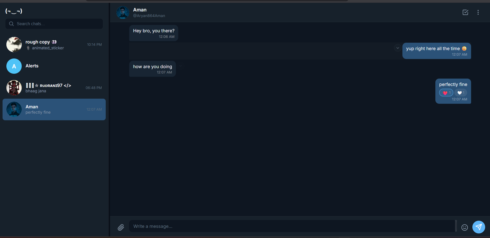
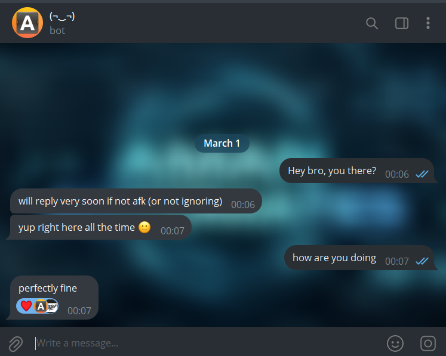
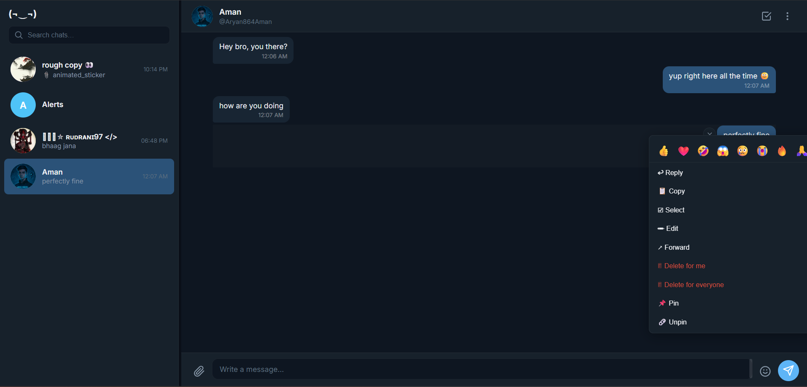
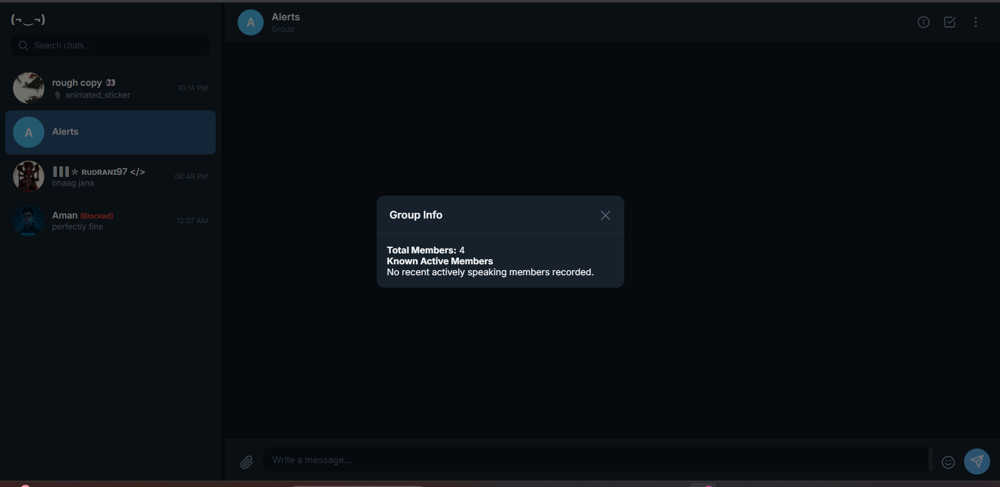

# TeleChat

> Chat with your Telegram contacts through your bot, a self-hosted web interface for Telegram DMs.

TeleChat monitors incoming DMs to your Telegram bot (and optionally your personal account), auto-replies when appropriate, stores every message & media locally, and gives you a beautiful **web chat UI** to reply, forward, and manage conversations.

---

## 📸 Showcase

<div align="center">
  <br><br>
  <br><br>
  <br><br>
  <br><br>
  
</div>

---

## ✨ Features

| Feature | Details |
|---|---|
| **Two modes** | **Bot only** (just `BOT_TOKEN`) or **Userbot + Bot** (monitors personal account too) |
| **Smart AFK reply** | Auto-reply only on first contact or after 2h of silence, no spamming |
| **Profile photos** | Real Telegram DPs displayed in the chat sidebar and headers |
| **Web chat UI** | Telegram style dark interface at `http://localhost:8080` |
| **Dynamic branding** | UI title & logo auto-set from your bot's name, no hardcoded names |
| **Real time WebSocket** | Messages appear instantly, no page refresh needed |
| **Resizable sidebar** | Drag the sidebar edge to resize; mobile-optimized with full-width sidebar |
| **Emoji picker** | Full emoji tray built into the chat input |
| **Media support** | Photos, videos, audio, voice, documents, stickers with inline previews |
| **File send** | Attach & send any file from the web UI |
| **Reply to messages** | Double click a message to reply (uses `reply_to_message_id`) |
| **Group Support** | Tracks group & supergroup conversations natively |
| **Admin Actions** | Moderation tools (Kick/Ban users) built right into the UI for groups |
| **Group Tracker** | Dedicated _Info_ button to display real-time active user rosters |
| **Multi select** | Click an avatar or select multiple messages, then **Copy / Delete / Forward** |
| **Message Pinning** | Pin or unpin messages via context menu across DMs and groups |
| **Delete Rules** | Native prompts support 'Delete for Me' vs 'Delete for Everyone' |
| **Forward** | Forward selected messages to other users |
| **Scroll history** | Loads messages in batches; scroll up to load more |
| **Native Modals** | Custom-built smooth dialogs safely replace awful browser alerts |
| **Local DB Storage** | Messages & users persisted natively in lightning fast Async SQLite (WAL Mode) |
| **Graceful shutdown** | Ctrl+C cleanly stops everything; port in use gives a clear error |

---

## � Tech Stack

- **Backend**: Python (`Telethon` for MTProto API, `aiohttp` for Web Server / WebSockets)
- **Frontend**: Vanilla JavaScript, CSS, HTML5
- **Database**: `aiosqlite` (Asynchronous SQLite with WAL Mode enabled for fast, concurrent I/O)

---

## 🎯 Motive

**Original Motive (Privacy):** 
Anyone with access to your Telegram account (e.g., on a shared physical desktop or a locally logged-in secondary device) can normally read your personal chats, invading your privacy. TeleChat completely solves this: since your main account is intentionally kept out of the loop, there is zero trace of the conversation on the official Telegram app. The authentic, private chat happens entirely off-record through your local Web UI, connecting you securely to the `allowed_user` exclusively via your Bot.


**Current Motive (Government Regulations):** 
As of March 1st, 2026, the Government of India released a SIM-binding security rule. A crucial clause dictates that desktop messaging applications will forcibly log out web/desktop users every 6 hours to prevent cybercrime. Continuously re-verifying logins is exhaustive. **This project bypasses that entirely.** Because TeleChat leverages a dedicated background bot/userbot session bound to APIs, you can chat continuously without needing to manually re-login to the official Telegram Desktop app every 6 hours!

---

## 🔄 How it Works (Flow)

1. **Initial Contact**: An `ALLOWED_USER` messages your bot directly. (If `CREATE_USER_BOT` is True, it also catches DMs sent to your main account).
2. **AFK Auto-Responder**: If they haven't interacted with you for over 2 hours, the bot automatically shoots them your customized AFK message.
3. **WebUI Sync**: Their incoming message is instantly piped to your local SQLite Database and simultaneously bridged to your Web Interface (`localhost:8080`) over lightning-fast local WebSockets. 
4. **Banned Users**: Anyone placed on the `BANNED_USERS` list is aggressively ignored. Their messages will never render in your web interface.
5. **Two-Way Communication**: When you type a reply on your web interface, the backend Python server executes the send command via the Telegram API natively. 
6. **Groups & Features**: Similar native group tracking is fully supported alongside full context actions like pinning, unpinning, kicking/banning, deleting (for everyone), replying, reacting, and forwarding natively via remote control from the local browser.

---

## �📂 Project Structure

```
├── .env                  # your credentials (create from .env.example)
├── .env.example          # template
├── .gitignore
├── requirements.txt
├── bot.py                # entry point, starts everything
├── src/
│   ├── config.py         # all settings & paths
│   ├── clients.py        # client factory (HttpBot or Telethon)
│   ├── handlers.py       # incoming message handlers + afk logic
│   ├── storage.py        # JSON read/write for users & messages
│   ├── http_bot.py       # lightweight HTTP Bot API client (no Telethon)
│   └── server.py         # aiohttp REST API + WebSocket + static
├── web/
│   ├── index.html        # chat UI
│   ├── css/style.css     # dark theme styles
│   └── js/app.js         # frontend logic
├── data/                 # created at runtime
│   ├── users.json
│   ├── avatars/          # cached profile photos
│   └── chats/
│       └── {FullName$$UserId}/
│           ├── messages.json
│           └── media/
└── sessions/             # Telethon .session files (only when create_user_bot=True)
```

---

## 🚀 Setup

### 1. Get a bot token

Create a bot via [@BotFather](https://t.me/BotFather) then `/newbot` and copy the token.

### 2. Configure

```bash
cp .env.example .env
```

**Minimum `.env` for bot only mode** (no API_ID / API_HASH needed):
```ini
BOT_TOKEN=123456:ABC...
CREATE_USER_BOT=False
ALLOWED_USERS=123456789,987654321
WEB_HOST=127.0.0.1
WEB_PORT=8080
```

**Full `.env` for userbot + bot mode:**
```ini
BOT_TOKEN=123456:ABC...
CREATE_USER_BOT=True
API_ID=12345678
API_HASH=abcdef1234567890
PHONE_NUMBER=+91XXXXXXXXXX
ALLOWED_USERS=123456789,987654321
WEB_HOST=127.0.0.1
WEB_PORT=8080
```

> `API_ID` and `API_HASH` are free from [my.telegram.org](https://my.telegram.org) under API Development Tools.

### 3. Add users directly
Add users to your `.env` lists to allow or block them:
```ini
ALLOWED_USERS=123456789,987654321
BANNED_USERS=11223344
```

> Tip: Send `/start` to [@userinfobot](https://t.me/userinfobot) to get your user ID.

### 4. Install & run

```bash
pip install -r requirements.txt
python bot.py
```

If using `CREATE_USER_BOT=True`, Telethon will ask for your phone's OTP code on first run.

### 5. Open the chat

Visit **http://127.0.0.1:8080** in your browser. The page title will automatically show your bot's name.

---

## 🎮 Usage

| Action | How |
|---|---|
| **View chats** | Sidebar shows all users who've messaged the bot |
| **Reply** | Double click a message to set reply, then type & press Enter |
| **Send file** | Click 📎, select file(s) |
| **Emoji** | Click 😊 button for the emoji picker |
| **Select messages** | Click ☑ in the header, then click messages |
| **Copy** | Select then **Copy** |
| **Pin / Unpin** | Right-click (or click arrow on) a message bubble and select **Pin** |
| **Group Management**| In groups, click the **ℹ️ (Info)** button for a member roster |
| **Admin Actions** | In groups, right-click an incoming message to **Kick** or **Ban** the specific sender |
| **Delete** | Select then **Delete** (removes from Telegram too) |
| **Forward** | Select then **Forward**, pick user(s), **Send** |
| **Resize sidebar** | Drag the right edge of the sidebar |
| **Load older msgs** | Scroll up or click "Load older messages..." |
| **Stop the bot** | Press **Ctrl+C** in the terminal |

---

## ⚙️ Configuration

All tunables live in `src/config.py`:

| Variable | Default | Purpose |
|---|---|---|
| `messages_per_load` | `30` | Messages fetched per scroll batch |
| `afk_message` | _"will reply very soon..."_ | Auto reply text |

In `src/handlers.py`:

| Variable | Default | Purpose |
|---|---|---|
| `afk_cooldown_hours` | `2` | Hours before the afk message is sent again to the same user |

In `.env`:

| Variable | Default | Purpose |
|---|---|---|
| `BOT_TOKEN` | ✅ Always | Telegram bot token from @BotFather |
| `CREATE_USER_BOT` | ✅ Always | `True` to also monitor personal account DMs |
| `ALLOWED_USERS` | ` ` | Comma-separated list of Telegram User IDs allowed to chat |
| `BANNED_USERS` | ` ` | Comma-separated list of User IDs blocked |
| `API_ID` | Only if `True` | From my.telegram.org |
| `API_HASH` | Only if `True` | From my.telegram.org |
| `PHONE_NUMBER` | Only if `True` | Your Telegram phone number |
| `WEB_HOST` | `127.0.0.1` | Web server bind address |
| `WEB_PORT` | No (default 8080) | Web UI port |

---

## 🔒 Security Notes

- The web UI runs on **localhost only**, no authentication needed.
- **SQL Injection Prevention:** Every single Database query utilizing your text or inputs routes through structural parameterized bindings `(?, ?, ...)` via the `aiosqlite` interface. Mathematical SQL injections are impossible—your SQLite Database strictly cannot be breached through standard malicious payloads!
- Session files in `sessions/` give full access to your Telegram account. **Never share them.**
- `.env` contains secrets, it's git ignored by default.
- Profile photo cache in `data/avatars/` is also git ignored.

---

## 📜 License

MIT, use however you like.

---

## Author

Made with ❤️ by [Aman](https://t.me/jarvisbyamanchannel)